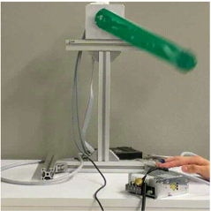
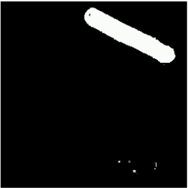

## PixelDHNN
Rammaru Dempoya

This repository and code are based on the below paper.
 
* HNN by S.Greydanus (https://github.com/greydanus/hamiltonian-nn)
* DHNN by A.Sosanya (https://github.com/DrewSosa/dissipative_hnns)

### Summary
This research is to apply the Dissipative Hamiltonian Neural Networks to the real space video.

### Dependencies
* Pytorch
* Numpy
* Scipy

This project is witten in Python 3.7.16
for more details, please see [requirements.txt](./env/requirements.txt)

### To make dataset for real space(Pendulum)
`*`The gifs shown are for reference only and are different from those actually generated.

1. Recording a movie of pendulum:[`experiment-pixels/img_proc/recording.py`](./experiment-pixels/img_proc/recording.py)

2. Extraction of the pendulum (Noise processing) :[`experiment-pixels/img_proc/extracter.py`](./experiment-pixels/img_proc/extracter.py)

3. Make a dataset form the pre-processed video :[`experiment-pixels/data.py`](./experiment-pixels/data.py)

4. The autoencoder is trained on the created dataset :[`experiment-pixels/train_AE.py`](./experiment-pixels/train_AE.py)
5. Create a dataset for input to DHNN from the trained AE model :[`experiment-pixels/data_forDHNN.py`](./experiment-pixels/data_forDHNN.py)

### To train a Pixel Dissipaive Neural Networks, and analyze results

3. Training of DHNN :[`experiment-pixels/train_latents_input.py`](./experiment-pixels/train_latents_input.py)
4. analyzing results :[`analyze-pixels-real.py`](./analyze-pixels-real.py)

